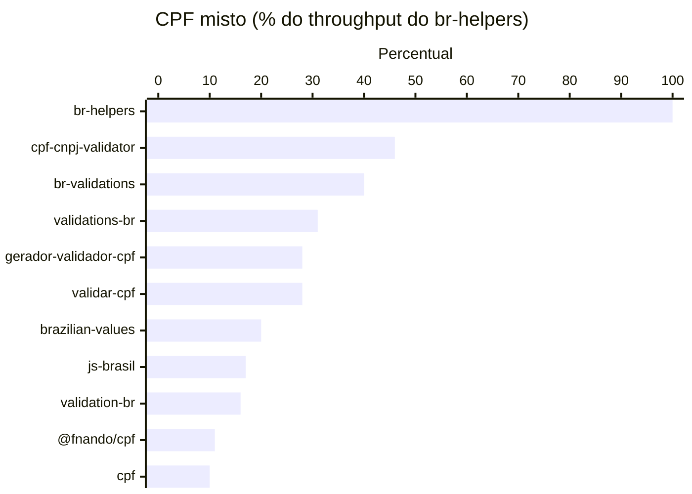
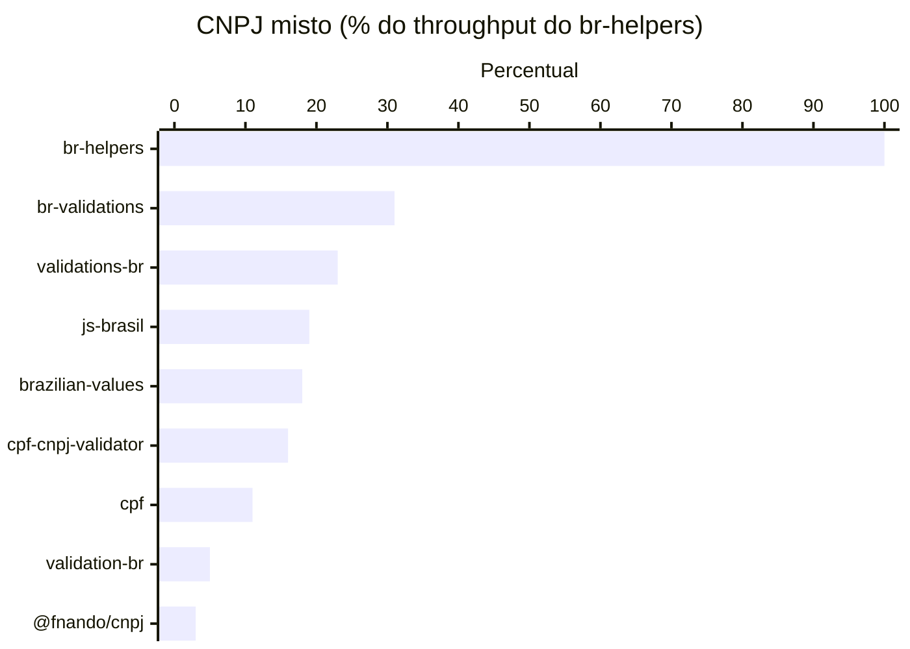

# br-helpers

[](https://sonarcloud.io/dashboard?id=alisterlf_br-helpers)
[](https://github.com/alisterlf/br-helpers/actions/workflows/node.js.yml)
[](https://codecov.io/gh/alisterlf/br-helpers)
[](https://www.npmjs.com/package/br-helpers)
[](https://bundlephobia.com/package/br-helpers)
[](./License.md)

Biblioteca para validar, formatar, analisar e normalizar identificadores brasileiros em projetos JavaScript e TypeScript.

## Desempenho

Na execução pública de benchmark de 11/08/2026 no repositório [br-helpers-benchmark](https://github.com/alisterlf/br-helpers-benchmark), o `br-helpers` 3.3.0 ficou em 1º lugar em todos os cenários de CPF e CNPJ, com 2x a 3x o throughput da segunda colocada no cenário misto. Desde a versão 3.3.0 a validação acontece em uma única passada sobre a string original, sem alocações, o que dobrou o throughput de CNPJ em relação à 3.2.0.

Nas tabelas abaixo, cada célula mostra `ops/s (% do throughput do br-helpers naquele cenário)`. Assim fica mais fácil comparar o valor absoluto e a distância relativa para a baseline.

### CPF

| Biblioteca              | Validos sem mascara |      DV incorreto |             Misto |
| ----------------------- | ------------------: | ----------------: | ----------------: |
| `br-helpers`            |   26,001,040 (100%) | 21,312,873 (100%) | 24,791,341 (100%) |
| `cpf-cnpj-validator`    |    11,846,096 (46%) |   8,658,908 (41%) |  11,380,794 (46%) |
| `br-validations`        |     9,725,734 (37%) |   7,557,893 (35%) |   9,863,230 (40%) |
| `validations-br`        |     6,675,924 (26%) |   5,512,013 (26%) |   7,747,774 (31%) |
| `gerador-validador-cpf` |     7,268,076 (28%) |   5,569,541 (26%) |   7,048,243 (28%) |
| `validar-cpf`           |     6,042,369 (23%) |   4,841,677 (23%) |   6,877,705 (28%) |
| `brazilian-values`      |     4,329,679 (17%) |   3,757,816 (18%) |   5,034,351 (20%) |
| `js-brasil`             |     3,831,476 (15%) |   3,346,653 (16%) |   4,110,952 (17%) |
| `validation-br`         |     5,768,410 (22%) |   3,060,462 (14%) |   4,075,544 (16%) |
| `@fnando/cpf`           |      1,938,120 (7%) |    1,798,678 (8%) |   2,728,126 (11%) |
| `cpf`                   |      1,961,723 (8%) |    1,738,707 (8%) |   2,584,594 (10%) |



### CNPJ

| Biblioteca           | Validos sem mascara |      DV incorreto |             Misto |
| -------------------- | ------------------: | ----------------: | ----------------: |
| `br-helpers`         |   20,888,165 (100%) | 17,606,874 (100%) | 19,995,468 (100%) |
| `br-validations`     |     6,523,838 (31%) |   4,535,806 (26%) |   6,282,355 (31%) |
| `validations-br`     |     4,797,175 (23%) |   3,582,124 (20%) |   4,632,904 (23%) |
| `js-brasil`          |     4,341,484 (21%) |   2,766,466 (16%) |   3,743,085 (19%) |
| `brazilian-values`   |     4,109,983 (20%) |   2,880,383 (16%) |   3,549,351 (18%) |
| `cpf-cnpj-validator` |     3,041,825 (15%) |   2,332,786 (13%) |   3,276,468 (16%) |
| `cpf`                |     2,277,593 (11%) |    1,585,093 (9%) |   2,273,928 (11%) |
| `validation-br`      |      1,038,008 (5%) |      804,925 (5%) |    1,079,296 (5%) |
| `@fnando/cnpj`       |        509,802 (2%) |      473,870 (3%) |       695,137 (3%) |



O benchmark também mede cenários com documentos válidos com máscara, entrada leniente (formatação fora do padrão), dígitos verificadores incorretos, dígitos repetidos e valores incompletos. Nem todas as bibliotecas comparadas suportam CNPJ alfanumérico, mas o `br-helpers` cobre CPF, CNPJ numérico e CNPJ alfanumérico no mesmo pacote.

Os números absolutos variam por máquina, versão do Node.js e dataset, então o ideal é consultar o repositório de benchmark para ver a metodologia, as tabelas completas e as bibliotecas incluídas na comparação.

### Como o desempenho é alcançado

- `isValid` valida entrada canônica (dígitos, letras no CNPJ e máscara nas posições padrão) em uma única passada sobre a string original: os dois somatórios de dígito verificador, o tamanho e a regra de caracteres repetidos são computados juntos, pulando os símbolos de máscara no lugar, sem regex, sem criar instâncias de `Identifier` e sem alocar uma cópia normalizada.
- Entrada fora do formato canônico (espaços, separadores deslocados, letras no CPF) mantém o contrato leniente: a normalização remove o que não pertence ao documento e o mesmo validador de passada única decide sobre o valor normalizado.
- A normalização percorre a entrada por `charCode`, sem regex no caminho quente. Entrada já normalizada é devolvida como está, sem alocação.
- Nenhum teste de padrão por regex é necessário: como os dígitos verificadores calculados estão sempre entre 0 e 9, uma letra nas duas últimas posições nunca confere.
- `parse` retorna objetos com chaves literais, mantendo formas monomórficas para o motor JavaScript.
- Entrada com caracteres não ASCII cai em um caminho de compatibilidade que preserva a semântica Unicode de `toUpperCase`.

### Como as mudanças de desempenho são verificadas

Toda mudança no caminho quente é comparada contra a branch `main` usando os mesmos datasets e a mesma configuração do repositório de benchmark, executando nas duas ordens de variante para descartar viés de ordem. Antes de medir, um fuzz diferencial com dezenas de milhares de entradas (documentos válidos, mascarados, mutados, truncados e lixo aleatório) confirma que `isValid` e `parse` retornam resultados idênticos aos da implementação anterior.

## Testes

- 94 testes unitários cobrem validação, formatação progressiva, análise, CLI e o contrato de entrada leniente, com 100% de cobertura de statements.
- O repositório de benchmark também roda uma [matriz de compatibilidade](https://github.com/alisterlf/br-helpers-benchmark#testes-de-compatibilidade) com 54 casos portados dos specs deste pacote contra as bibliotecas populares do npm. Na execução de 11/08/2026, o `br-helpers` foi o único pacote a passar em todos os casos, incluindo CNPJ alfanumérico e entrada leniente.
- O contrato leniente é coberto por spec: espaços em volta ou entre os caracteres, separadores deslocados ou duplicados, letras misturadas a um CPF válido, caracteres não ASCII e entrada numérica (`Cpf.isValid(13768663663)`) validam como o valor normalizado.

## O que o pacote oferece

- `Cpf`: validação, formatação progressiva e análise completa.
- `Cnpj`: validação, formatação e análise de CNPJ numérico e alfanumérico.
- `Cep`: validação estrutural e formatação.
- `Phone`: validação de DDD, detecção de linha fixa ou celular e `parse`.
- `NumericIdentifier` e `AlphanumericIdentifier`: normalização reutilizável para regras customizadas, incluindo `normalizeValue` estático sem criação de instância.
- `Identifier` e `MaskSlot`: primitives para construir máscaras e abstrair novos helpers.
- CLI `br-helpers`: comandos para terminal com saída em texto ou JSON.
- Exportações raiz e por subpath para consumo pontual.

## Instalação

```bash
npm install br-helpers
```

Para instalar a CLI globalmente:

```bash
npm install -g br-helpers
```

Também funciona com `yarn add br-helpers` ou `pnpm add br-helpers`.

## Compatibilidade

- Node.js: suporte oficial a `>= 20`.
- Módulos: build CommonJS e ESM publicadas no mesmo pacote.
- Subpaths: `br-helpers/cpf`, `br-helpers/cnpj`, `br-helpers/cep`, `br-helpers/phone` e `br-helpers/identifiers`.
- CI: cobertura validada em `Node.js 20`, `22` e `24`.
- Polyfills: o pacote não injeta polyfills automaticamente.

## Início rápido

```ts
import { Cep, Cnpj, Cpf, Phone } from 'br-helpers';
import { NumericIdentifier } from 'br-helpers/identifiers';

Cpf.isValid('137.686.636-63'); // true
Cnpj.format('12abc34501de35'); // '12.ABC.345/01DE-35'
Cep.format('01311200'); // '01311-200'
Phone.parse('(11) 97983-7935').kind; // 'mobile'
NumericIdentifier.from('CPF: 137.686.636-63').value; // '13768663663'
```

Se você preferir importar apenas um helper:

```ts
import { Cnpj } from 'br-helpers/cnpj';
import { AlphanumericIdentifier } from 'br-helpers/identifiers';
```

Em CommonJS:

```js
const { Cep, Cnpj, Cpf, Phone } = require('br-helpers');
const { NumericIdentifier } = require('br-helpers/identifiers');
```

## API resumida

| Export                                                      | API principal                                                              | Quando usar                                    |
| ----------------------------------------------------------- | -------------------------------------------------------------------------- | ---------------------------------------------- |
| `Cpf`                                                       | `parse`, `isValid`, `format`                                               | CPF com ou sem máscara.                        |
| `Cnpj`                                                      | `parse`, `isValid`, `format`                                               | CNPJ numérico legado e alfanumérico.           |
| `Cep`                                                       | `isValid`, `format`                                                        | CEP com validação estrutural de 8 dígitos.     |
| `Phone`                                                     | `parse`, `isValid`, `format`                                               | Telefone com DDD e detecção de tipo da linha.  |
| `NumericIdentifier`                                         | `from`, `normalizeValue`, `value`, `digits`, `length`, `isEmpty`, `format` | Regras estritamente numéricas.                 |
| `AlphanumericIdentifier`                                    | `from`, `normalizeValue`, `value`, `digits`, `length`, `isEmpty`, `format` | Regras alfanuméricas em maiúsculo.             |
| `Identifier`                                                | `value`, `digits`, `length`, `isEmpty`, `format`                           | Classe base abstrata para extensões.           |
| `MaskSlot`                                                  | `[position, symbol]`                                                       | Tipo para descrever máscaras customizadas.     |
| `CpfAnalysis`, `CnpjAnalysis`, `PhoneAnalysis`, `PhoneKind` | Tipos exportados                                                           | Tipagem de retorno e composição em TypeScript. |

## Exemplos

### CPF

```ts
import { Cpf } from 'br-helpers';

Cpf.isValid('137.686.636-63'); // true
Cpf.isValid('000.000.000-00'); // false

Cpf.format('13768663663'); // '137.686.636-63'
Cpf.format('1376866366'); // '137.686.636-6'

const cpf = Cpf.parse('137.686.636-63');

cpf.raw; // '137.686.636-63'
cpf.digits; // '13768663663'
cpf.valid; // true
cpf.formatted; // '137.686.636-63'
```

### CNPJ

```ts
import { Cnpj } from 'br-helpers';

Cnpj.isValid('26.149.878/0001-87'); // true
Cnpj.isValid('12ABC34501DE35'); // true
Cnpj.isValid('12abc34501de35'); // true
Cnpj.isValid('26.149.878/0001-88'); // false

Cnpj.format('26149878000187'); // '26.149.878/0001-87'
Cnpj.format('12abc34501de35'); // '12.ABC.345/01DE-35'
Cnpj.format('12ABC34501DE'); // '12.ABC.345/01DE'

const cnpj = Cnpj.parse('12abc34501de35');

cnpj.raw; // '12abc34501de35'
cnpj.value; // '12ABC34501DE35'
cnpj.valid; // true
cnpj.formatted; // '12.ABC.345/01DE-35'
```

`Cnpj` aceita o formato numérico legado e o novo formato alfanumérico. Letras minúsculas são normalizadas para maiúsculas, e os dois últimos caracteres continuam sendo dígitos verificadores.

### CEP

```ts
import { Cep } from 'br-helpers';

Cep.isValid('01311-200'); // true
Cep.isValid('123'); // false

Cep.format('01311200'); // '01311-200'
Cep.format('0131120'); // '01311-20'
```

`Cep.isValid` valida apenas a estrutura do valor normalizado. Ele não consulta existência real do CEP.

### Telefone

```ts
import { Phone } from 'br-helpers';

Phone.isValid('(11) 97983-7935'); // true
Phone.isValid('(11) 4983-7935'); // true
Phone.isValid('00979837935'); // false

Phone.format('11979837935'); // '(11) 97983-7935'
Phone.format('1149837935'); // '(11) 4983-7935'
Phone.format('11979837'); // '(11) 97983-7'

const phone = Phone.parse('(11) 97983-7935');

phone.raw; // '(11) 97983-7935'
phone.digits; // '11979837935'
phone.ddd; // '11'
phone.kind; // 'mobile'
phone.valid; // true
phone.formatted; // '(11) 97983-7935'
```

`phone.kind` pode retornar `'mobile'`, `'landline'` ou `null` enquanto o número ainda não permite identificação.

### NumericIdentifier

```ts
import { NumericIdentifier, type MaskSlot } from 'br-helpers/identifiers';

const cpfMask: MaskSlot[] = [
  [3, '.'],
  [6, '.'],
  [9, '-'],
];

const numeric = NumericIdentifier.from('CPF: 137.686.636-63');

numeric.value; // '13768663663'
numeric.length; // 11
numeric.isEmpty(); // false
numeric.digits; // '13768663663'
numeric.format(cpfMask); // '137.686.636-63'

// Normalização sem criar instância:
NumericIdentifier.normalizeValue('CPF: 137.686.636-63'); // '13768663663'
```

### AlphanumericIdentifier

```ts
import { AlphanumericIdentifier, type MaskSlot } from 'br-helpers/identifiers';

const cnpjMask: MaskSlot[] = [
  [2, '.'],
  [5, '.'],
  [8, '/'],
  [12, '-'],
];

const identifier = AlphanumericIdentifier.from('12abc345/01de-35');

identifier.value; // '12ABC34501DE35'
identifier.length; // 14
identifier.isEmpty(); // false
identifier.digits; // '123450135'
identifier.format(cnpjMask); // '12.ABC.345/01DE-35'

// Normalização sem criar instância:
AlphanumericIdentifier.normalizeValue('12abc345/01de-35'); // '12ABC34501DE35'
```

### Formatação progressiva

Os métodos `format` podem ser usados durante a digitação.

```ts
import { Cep, Cnpj, Cpf, Phone } from 'br-helpers';

Cpf.format('137686'); // '137.686'
Cnpj.format('12ABC34501'); // '12.ABC.345/01'
Cep.format('0131120'); // '01311-20'
Phone.format('119798'); // '(11) 9798'
```

## CLI

O pacote publica o binário `br-helpers` com os comandos `cpf`, `cnpj`, `cep`, `phone` e `identifier`.

```bash
npx br-helpers cpf 13768663663
npx br-helpers cnpj 12abc34501de35 --output json
npx br-helpers phone "(11) 97983-7935" --field digits
npx br-helpers cep 01311200 --field formatted
npx br-helpers identifier "CPF: 137.686.636-63"
```

### Opções da CLI

- `--field` ou `-f`: retorna apenas um campo específico.
- `--output` ou `-o`: alterna entre `text` e `json`.
- `cpf`, `cnpj`, `cep` e `phone` encerram com código `0` quando o valor é válido e `2` quando é inválido.
- `identifier` sempre encerra com código `0`.

### Exemplo de saída JSON

```bash
npx br-helpers cnpj 12abc34501de35 --output json
```

```json
{
  "raw": "12abc34501de35",
  "value": "12ABC34501DE35",
  "valid": true,
  "formatted": "12.ABC.345/01DE-35"
}
```

## Tipos de retorno

```ts
type CpfAnalysis = {
  raw: unknown;
  digits: string;
  valid: boolean;
  formatted: string;
};

type CnpjAnalysis = {
  raw: unknown;
  value: string;
  valid: boolean;
  formatted: string;
};

type PhoneAnalysis = {
  raw: unknown;
  digits: string;
  ddd: string | null;
  kind: 'mobile' | 'landline' | null;
  valid: boolean;
  formatted: string;
};

type MaskSlot = [position: number, symbol: string];
```

## Migrando do v2 para o v3

- `Digits` foi substituído por `NumericIdentifier` e `AlphanumericIdentifier`.
- `Digits.from(value).mask(mask)` agora vira `NumericIdentifier.from(value).format(mask)`.
- `import { Digits } from 'br-helpers/digits'` agora vira `import { NumericIdentifier, AlphanumericIdentifier } from 'br-helpers/identifiers'`.
- `Cnpj.parse(...).digits` agora vira `Cnpj.parse(...).value`.
- O `Cnpj` passa a aceitar e normalizar letras no corpo do documento.

Os detalhes completos da mudança estão em [CHANGELOG.md](./CHANGELOG.md).

## TypeScript

O pacote publica declarações de tipo junto com a build em `dist`, então autocomplete e inferência funcionam sem configuração extra.

## Licença

[MIT](./License.md)
